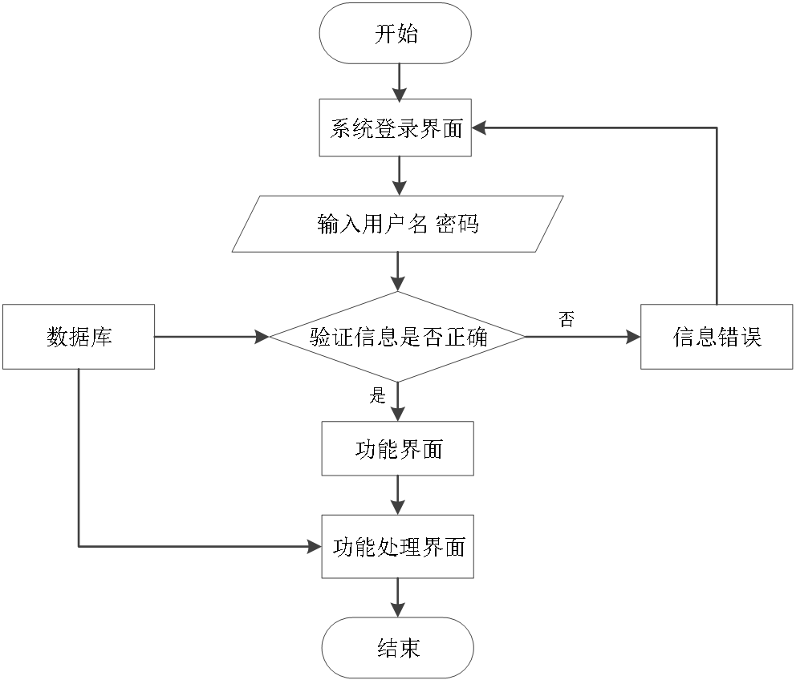
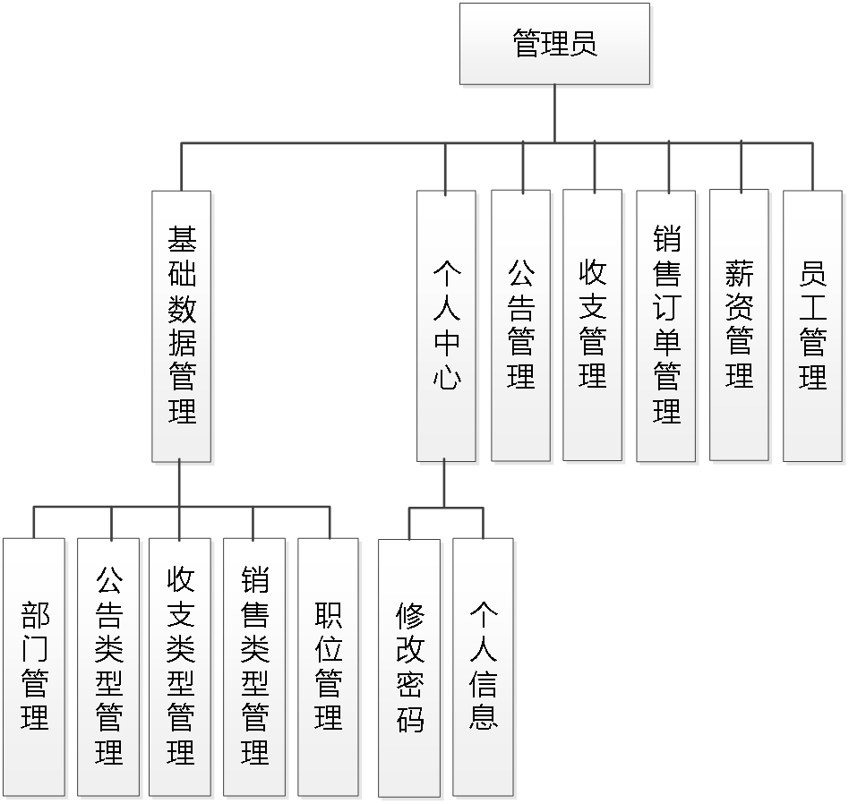
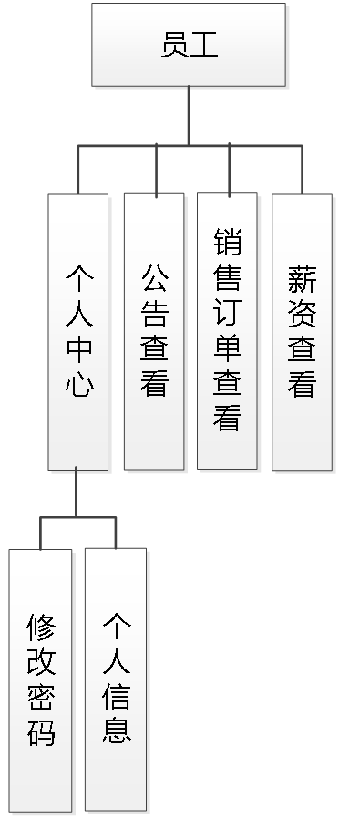
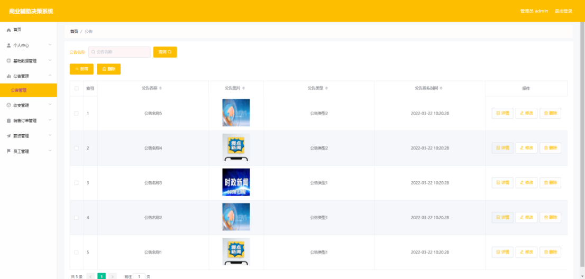
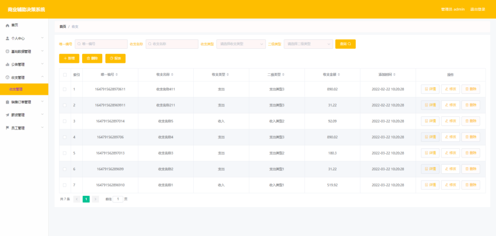
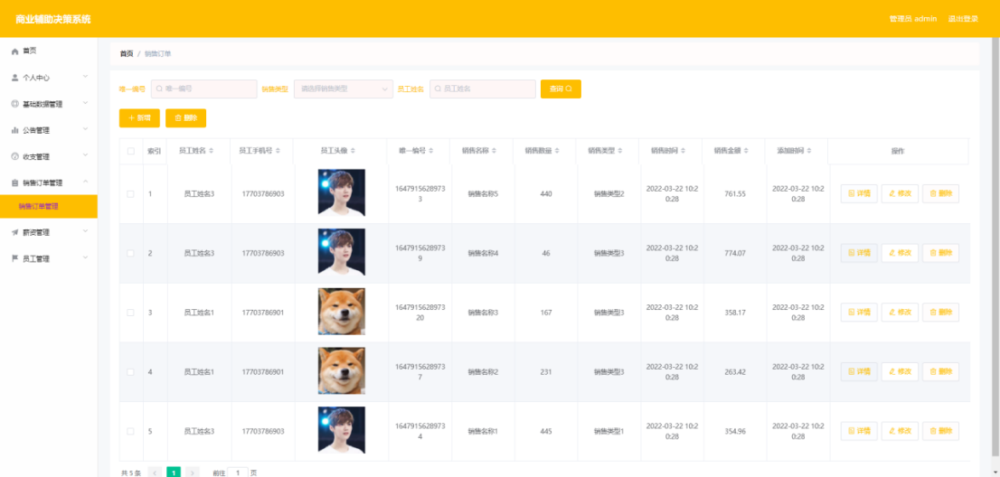
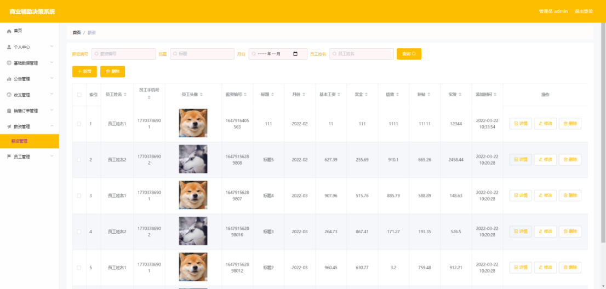
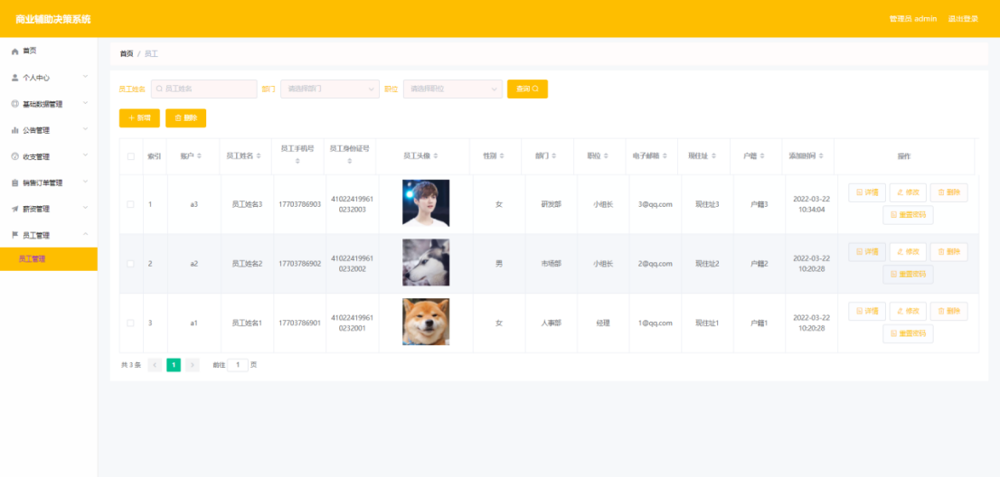
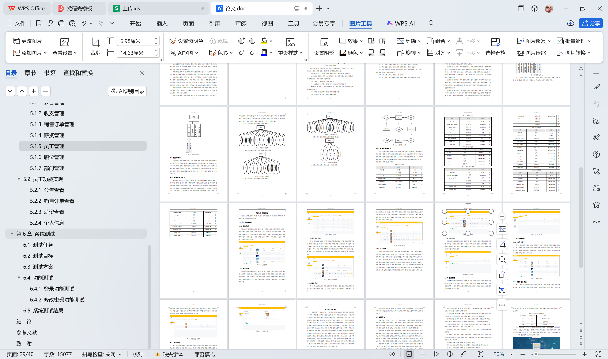

# springboot193-商业辅助决策系统的设计与实现

>  博主介绍：
>  Hey，我是程序员Chaers，一个专注于计算机领域的程序员
>  十年大厂程序员全栈开发‍ 日常分享项目经验 解决技术难题与技术推荐 承接各类网站设计，小程序开发，毕设等。
>  【计算机专业课程设计，毕业设计项目，Java，微信小程序，安卓APP都可以做，不仅仅是计算机专业，其它专业都可以】

## 3000套系统可挑选，获取链接：https://chaerspol.github.io/

<b>QQ【获取完整源码】：674456564</b>

<b>QQ群【获取完整源码】：1058861570</b>

### 系统架构

> 前端：html | js | css | jquery | vue
>
> 后端：springboot | mybatis
> 
> 环境：jdk1.8+ | mysql | maven

# 一、内容包括
包括有  项目源码+项目论文+数据库源码+答辩ppt+远程调试成功

# 二、运行环境

> jdk版本：1.8 及以上； ide工具：IDEA； 数据库: mysql5.7及以上；编程语言: Java

# 三、需求分析

**3.1 可行性分析**

从三个不同的角度来分析，确保开发成功的前提是有可行性分析，只有进行提前分析，符合程序开发流程才不至于开发过程的中断。

**3.1.1 技术可行性**

在技术实现层次，分析了好几种技术实现方法，并且都有对应的成功案例，也有很多开源模块可以进行参考，所以从技术可行性分析来讲，实现商业辅助决策系统是没有问题的。

**3.1.2 经济可行性**

对于身为学生的开发者而言，在经济资源上面可用者很少，为了开发商业辅助决策系统，通过开发软件对硬件的要求，发现自己的电脑是完全能用来开发的，并且学校机房的配置也可以达到要求。最重要的是选择的技术都可以在网上找到不花钱的教程以及资料，因为不花钱，所以经济方面是具有可行性的。

**3.1.3 操作可行性**

商业辅助决策系统的具体实现，本身参考人类的正常操作逻辑，把常用的操作习惯当做主要的导航实现，可以让使用者更快速的理解并且上手操作，实现符合逻辑的操作流程是操作可行性的具体体现。
以上就是从不同的角度来分析，确保了商业辅助决策系统的正常开展。

**3.2 系统流程**

商业辅助决策系统投入使用后，使用者如果能看到相应的流程操作图会提高程序的理解能力。
使用者在操作商业辅助决策系统中，应该按照本系统提供的操作流程（图3.1即为本系统的操作流程图）进行操作，可以减少操作失误，从而节省进入商业辅助决策系统的时间。

# 四、功能模块

下图即为设计的管理员功能结构，管理员权限操作的功能包括管理员工基本信息，管理收入信息，管理支出信息，增删改查销售订单信息，增删改查员工薪资信息等。

下图即为设计的员工功能结构，员工权限操作的功能包括查看自己的薪资信息，查看销售订单信息，查看公告，更改个人信息与登录密码等。

# 五、效果图展示【部分效果图】

图5.1 公告管理界面【图5.1 即为编码实现的公告管理界面，管理员在公告管理界面中发布公告，已经发布的公告信息如果存在错误信息，可以及时更改，在公告管理界面，管理员对需要删除的公告进行删除，查询公告信息时，需要在查询框中编辑公告名称才可以查询出公告信息，公告信息不仅包括公告图片，公告类型，也包括公告名称，公告发布时间等信息。】

图5.2 收支管理界面【图5.2 即为编码实现的收支管理界面，管理员在收支管理界面中新增收支信息，主要是对支出信息或者是收入信息进行登记，已经新增的收支信息存在登记错误的情况，也能及时更改，在收支管理界面，管理员也能删除需要删除的收支信息，查看收支报表，收支信息主要包括收支类型，收支金额信息，以及收支名称等信息。】

图5.3 销售订单管理界面【图5.3 即为编码实现的销售订单管理界面，管理员在销售订单管理界面可以新增销售订单信息，销售订单信息主要包括销售数量，销售时间，销售金额，员工姓名，销售名称，添加时间等信息，销售订单信息存在登记错误的情况也能及时更改，同时在销售订单管理界面，管理员也能删除需要删除的销售订单信息，根据员工姓名查询销售订单，或者是选择销售类型来完成对销售订单信息的筛选。】

图5.4 薪资管理界面【图5.4 即为编码实现的薪资管理界面，管理员在薪资管理界面新增员工薪资，员工薪资主要包括基本工资，奖金，绩效，补贴，实发薪资，添加时间，月份，员工姓名，员工头像，员工手机号等信息，已经存在的员工薪资信息如果存在登记错误的情况，也可以及时更改，在薪资管理界面，管理员可以删除需要删除的薪资信息，提供员工姓名可以对员工薪资信息进行查询，或者选择月份来完成对员工薪资信息的筛选等。】

图5.5 员工管理界面【图5.5 即为编码实现的员工管理界面，管理员新增员工信息，员工信息如果存在登记错误的情况，可以及时更改，在员工管理界面，管理员也能删除需要删除的员工信息，对员工的账户进行密码重置，员工信息主要包括员工身份证号，员工手机，员工姓名，部门，性别，电子邮箱，户籍，现住址等信息，管理员如果需要快速找到需要的员工信息，可以使用员工管理界面的查询功能，查询前，需要在查询框中登记信息，如果选择根据员工姓名查询，则需要对员工的姓名进行登记才能查询，如果选择职位查询，那么需要选择员工的职位信息才能查询员工信息，如果选择部门查询，那么需要选择员工所属的部门才能查询出员工信息。】

 <b>完整文章</b>
 
 
 

## 3000套系统可挑选，获取链接：https://chaerspol.github.io/

<b>QQ【获取完整源码】：674456564</b>

<b>QQ群【获取完整源码】：1058861570</b>

